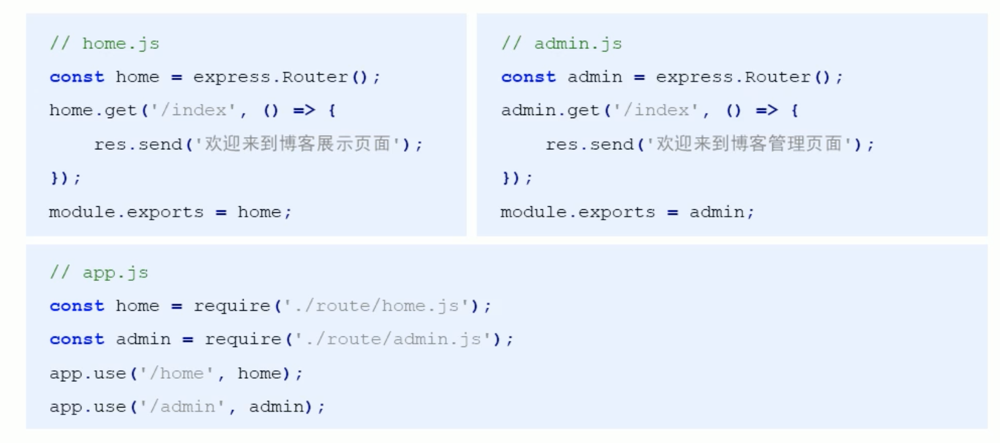
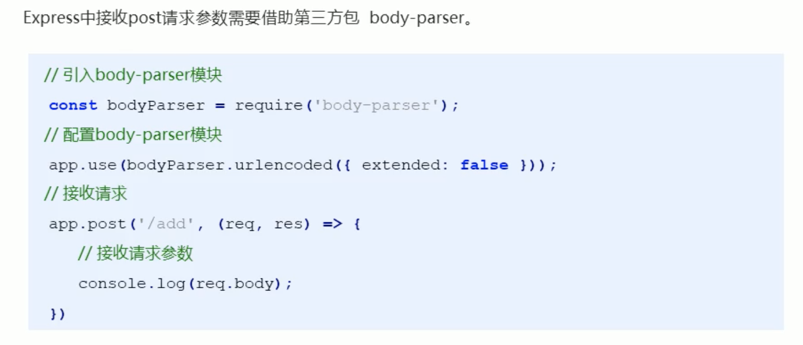

## 安装
```js
npm install express
```

## 特性
- 没有内置的模板引擎，但是对第三方的支持度较好
- 提供的中间件机制可以有效控制HTTP请求
- 拥有大量的第三方中间件对其功能进行扩展

## 基本使用
```js
const express = require('express');
const app = new express();

app.get('/', (req, res) => {
    // send 会自动设置Content-type 为 text/html
    res.send('hello');
});
 
app.get('/list', (req, res) => {
    // send 会自动设置Content-type 为 application/json
    res.send({name: 'xx', age: 18});
})

app.listen(3000);

console.log('server started');
```

## 中间件的基本使用
中间件使用的最初模型如下  
通过next函数交给下一个相同路由的处理函数
```js
app.get('/', (req, res, next) => {
    req.name = 'xuwei';
    next();
});

app.get('/', (req, res, next) => {
    res.send({name: req.name, age: 18});
});
```
## app.use的使用
后面进行了改造，通过新增`app.use`方法，可以不用区分是get请求还是post请求，只要url匹配，就可以进行处理  
```js

// 不指定处理的url，则可以拦截处理全部的请求
app.use((req, res, next) => {
    console.log('get request');
    next();  
})

// 处理url以/list开头的请求，不区分get or post
app.use('/list', (req, res, next) => {
    console.log('get list request');
    next();  
})
```
> 需要注意的是，请求到达时，依旧是按照文件从上往下的顺序匹配路由，所以不能将app.use写在app.get的下方，要不然app.use永远不会被触发。如下就是错误的使用

```js
app.get('/list', (req, res) => {
    res.send({name: req.name, age: 18});
})
// 因为该use写在get下方，所以并不会得到执行，浏览器得到的是{age: 18}
app.use('/list', (req, res, next) => {
    req.name = 'sss';
    next();
})
```
思考， 如果是以下的定义，服务器会返回什么呐？  
```js
app.get('/list', (req, res) => {
    res.send({name: req.name, age: 18});
})
app.use('/', (req, res, next) => {
    req.name = 'sss';
    next();
})
```
依然是{age: 18}  
所以可以断定，express单纯靠顺序来匹配，没有路径的优先级之说  
基于此，可以实现自定义404  

## 错误处理中间件
```js
app.use((err, req, res, next) => {
    res.status(500).send('server error');
})
```

## 构建模块化路由
```js
const express = require('express');
const title = express.Router();
app.use('/index', title);

title.get('/news', (req, res) => {
    res.send('hello');
});
title.get('/guest', (req, res) => {
    res.send({name: 'xx', age: 18});
})
```
/index/news 会返回 hello  
/index/guest 会返回 {name: 'xx', age: 18}

  

## GET参数的获取


## POST参数的获取

```
body-parse主要做了以下工作
1. 解析body体并转化为对象
2. 给req对象添加属性body,并赋值为上面获得的对象
3. 调用next函数
```
> 注意，bodyParser.urlencoded 函数返回值仍是一个函数，并且函数的入参为(res, req, next)

```js
function fn() {
    return function (req, res, next) {
        console.log('xxxx');
        next();
    }
}

app.use(fn());
```

## 