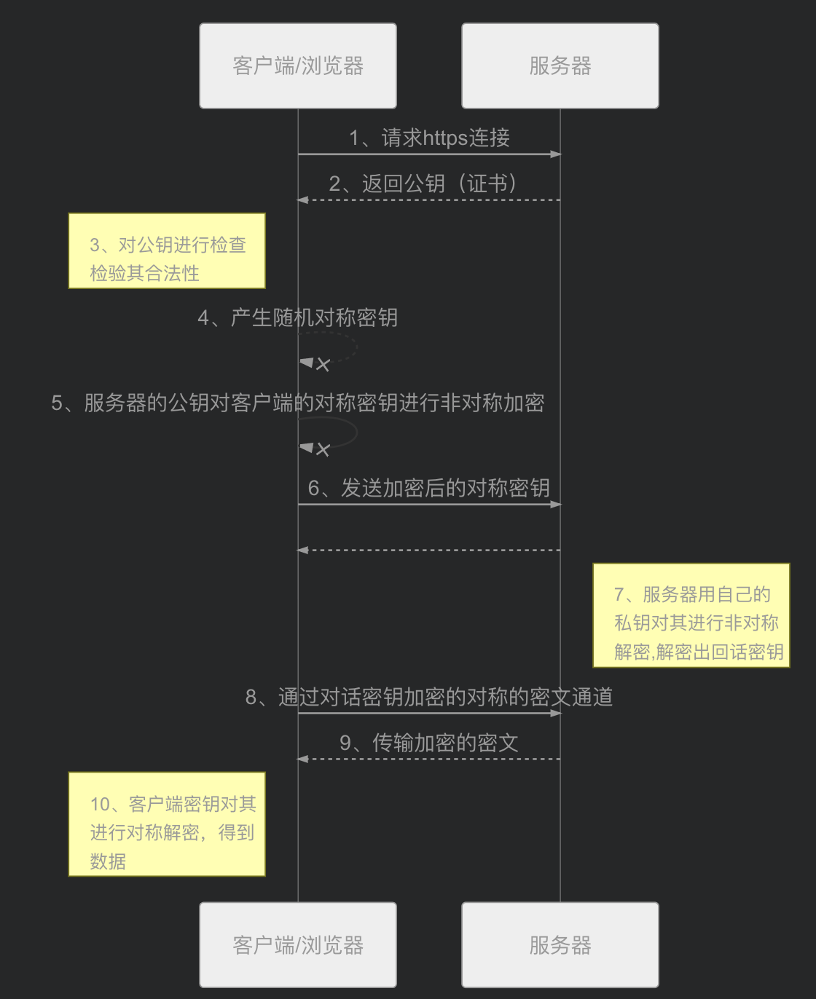

## 概念
HTTPS协议 = HTTP协议 + SSL/TLS协议
```
在HTTPS数据传输的过程中(端口443)，
需要用SSL/TLS对数据进行加密和解密，
需要用HTTP对加密后的数据进行传输，
由此可以看出HTTPS是由HTTP和SSL/TLS一起合作完成的。
```

## SSL TSL
```
SSL的全称是Secure Sockets Layer，即安全套接层协议，是为网络通信提供安全及数据完整性的一种安全协议。
TLS的全称是Transport Layer Security，即传输层安全协议
```

## 加密方式
HTTPS为了兼顾安全与效率，同时使用了[对称加密和非对称加密](./Network-对称加密与非对称加密.md)
```
数据是被对称加密传输的，对称加密过程需要客户端的一个密钥，为了确保能把该密钥安全传输到服务器端，
采用非对称加密对该密钥进行加密传输，总的来说，对数据进行对称加密，对称加密所要使用的密钥通过非对称加密传输。
```
## 传输过程
```
一个HTTPS请求实际上包含了两次HTTP传输，可以细分为以下几步:
```

```
HTTPS通信原理的过程大概是这样：
1.当客户端请求建立HTTPS连接时，服务器会发送公钥（即证书）。
2.客户端会对公钥进行检查、验证证书的合法性，验证通过的，会产生随机的对称密钥，客户端用服务器的公钥会对客户端的对称密钥进行非对称加密，传输过程中对要发送的数据采用对称加密，对密钥采用非对称加密，然后客户端将加密之后的客户端密钥发送给服务器，
3.服务器收到密文后用私钥对其进行非对称解密，得到客户端密钥；
4.服务器用客服端密钥对数据进行对称加密，变成密文然后服务器将密文传输给客户端。
5.客户端收到密文后用客户端密钥对其进行对称解密即得数据。
```