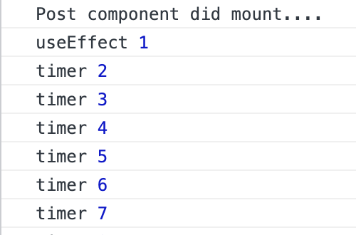
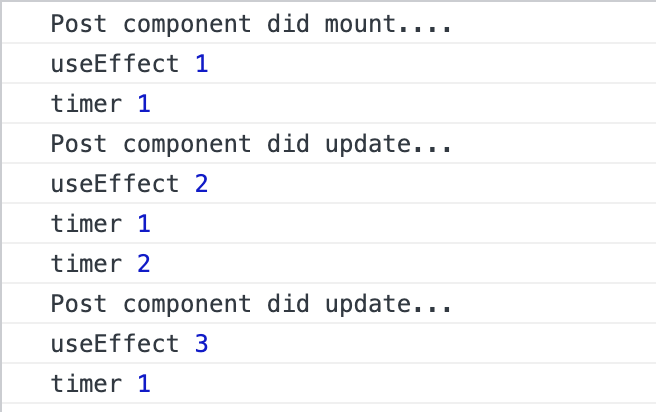

As you know, useEffect第二个参数可以在指定变量变化时才触发回调。
此时有两种情况：
1. 此变量为普通变量

```js
const Post = () => {
    usePrintComponentState('Post');
    let num = 1;
    useEffect(() => {
        console.log("useEffect", num);
    }, [num])

    setInterval(() => {
        num += 1;
        console.log("timer", num);
    }, 1000);

    return (
        <div>
            <h2>Post</h2>
        </div>
    );
}
```
num每秒自增1，虽然num变化了，但是由于num为普通变量,`console.log("useEffect", num);`并不会在num每次变化时调用。
实际测试发现，只会在component did mount 时触发一次此方法。


2. 此变量为state变量

```js
const Post = () => {
    usePrintComponentState('Post');
    const [num, setNum] = useState(1);
    useEffect(() => {
        console.log("useEffect", num);
    }, [num])

    setInterval(() => {
        setNum(num+1);
        console.log("timer", num);
    }, 1000);
    return (
        <div>
            <h2>Post</h2>
        </div>
    );
}

```
